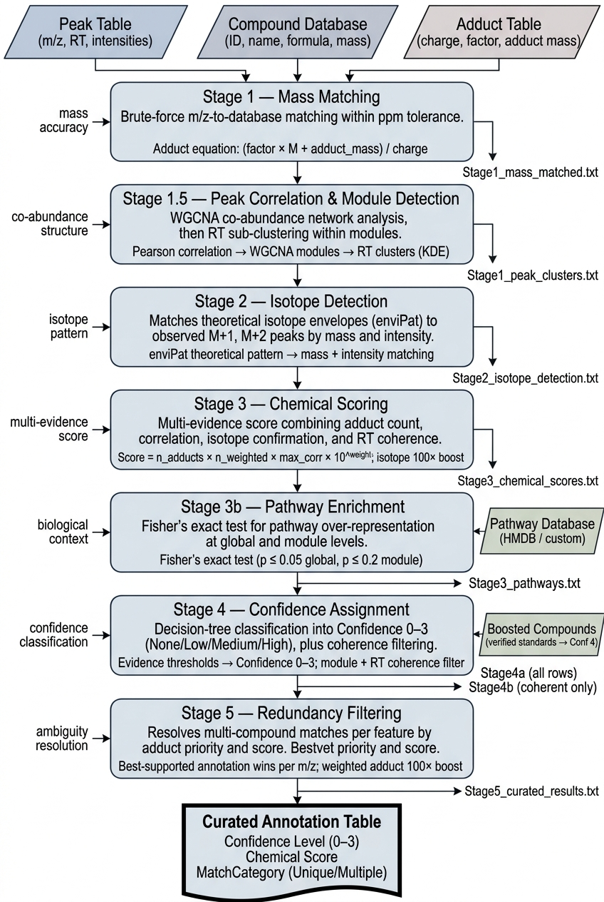
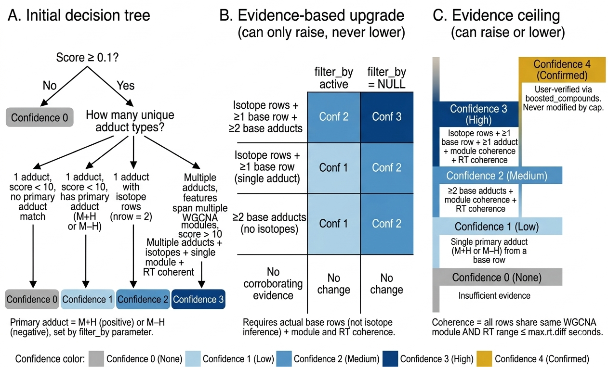

# CLUES.xMSannotator

An updated fork of [RECETOX/recetox-xMSannotator](https://github.com/RECETOX/recetox-xMSannotator) for automated annotation of untargeted mass spectrometry data, maintained by [CLUES-Emory](https://github.com/CLUES-Emory).

**Lineage:** [kuppal2/xMSannotator](https://github.com/kuppal2/xMSannotator) (original) &#8594; [RECETOX/recetox-xMSannotator](https://github.com/RECETOX/recetox-xMSannotator) (refactored) &#8594; **CLUES-Emory/CLUES-xMSannotator** (this repo)

## Documentation & Examples

### Guides

| Document | Description |
|----------|-------------|
| [Pipeline Workflow Reference](docs/xMSannotator_Workflow.md) | Complete 5-stage pipeline reference with scoring formulas, parameter guide, and troubleshooting |
| [Input File Formats](docs/xMSannotator_Input_Formats.md) | API-level specification for all input tables, parameters, and working examples |
| [Input Data Pre-Processing](docs/advanced_annotation_input_formatting.md) | XCMS feature table, sample mapfile, and compound database formats with pre-processing steps |
| [Stage 5 Output Reference](docs/Stage5_Output_Reference.md) | Column definitions for the primary output file |
| [Changelog](docs/CHANGELOG.md) | All notable changes, bug fixes, and new features |

### Example Scripts

| Script | Description |
|--------|-------------|
| [Example Runscript](inst/scripts/xMSannotator_CLUES_Runscript_Example.R) | Complete single-database annotation workflow |
| [Multi-DB Runscript](inst/scripts/xMSannotator_CLUES_MultiDB_Runscript.R) | SLURM array job script for multi-database annotation |
| [SLURM Wrapper](inst/scripts/run_CLUES_xMSannotator.sh) | Bash/SLURM submission script for dual-polarity batch jobs |

### recetox-xMSannotator Developer & Legacy Docs

| Document | Description |
|----------|-------------|
| [Developer Documentation](docs/developer_documentation.md) | Setup, code style, and testing framework |
| [Testing](docs/testing.md) | testthat/patrick testing and code coverage |
| [Modifications](docs/modifications.md) | Changes vs. original xMSannotator |
| [Refactoring Patterns](docs/refactoring.md) | Design patterns used during refactoring |
| [Possible Issues](docs/possible_issues.md) | Known issues from the original codebase |
| [Research Reproducibility](docs/research_reproducibility.md) | Online data dependencies affecting reproducibility |

## Pipeline Overview

<p align="center">
  
</p>

***Figure 1. Overview of the xMSannotator annotation workflow.** The pipeline takes a peak table, compound database, and adduct table as inputs and proceeds through six stages: (1) brute-force mass matching within ppm tolerance, (1.5) WGCNA co-abundance network analysis with RT sub-clustering, (2) theoretical isotope envelope matching via enviPat, (3) multi-evidence chemical scoring combining adduct count, correlation, isotope confirmation, and RT coherence, (3b) pathway enrichment using Fisher's exact test, (4) confidence assignment (0–3) via decision-tree classification with module and RT coherence filtering, and (5) redundancy filtering to resolve multi-compound matches per feature. User-verified compounds supplied via the boosted_compounds parameter receive Confidence 4. The final output is a curated annotation table with confidence levels, chemical scores, and match categories.*

The annotation pipeline runs through five stages via `advanced_annotation()`. See the [Pipeline Workflow Reference](docs/xMSannotator_Workflow.md) for full algorithmic details, scoring formulas, and parameter guidance.

1. **Stage 1 - Mass Matching**: Matches observed m/z values to compound databases across all specified adducts. Assigns peaks to correlation-based modules and RT clusters.
2. **Stage 2 - Isotope Detection**: Identifies isotopic peaks (M+1, M+2, etc.) based on mass differences, intensity ratios, and RT agreement.
3. **Stage 3 - Chemical Scoring**: Scores each compound annotation using adduct correlation evidence, module membership, and isotope support. Optionally integrates pathway enrichment (HMDB or custom).
4. **Stage 4 - Confidence Assignment**: Assigns confidence levels (0-4) based on adduct evidence, isotope detection, RT coherence, and module coherence. Enforces hard evidence requirements via a post-hoc cap (see [Confidence Levels](#confidence-levels)). Identifies isotopologues (e.g., 13C, 15N substitutions). Adds `Confidence_Level` text labels to output. Outputs Stage4a (all rows) and Stage4b (coherent rows only); Stage 5 uses Stage4b.
5. **Stage 5 - Redundancy Filtering (opt-in)**: When `redundancy_filtering = TRUE`, resolves features matched to multiple compounds to a single row per `(mz, time)`. Off by default — `Stage4b_confidence_levels.txt` is the canonical final output, since Stage 5's deletion of losing-compound rows can orphan the secondary adduct and isotope evidence that other compounds' confidence values were computed from.

All intermediate results are saved as tab-delimited text files (`Stage1_*.txt` through `Stage4b_*.txt`) for inspection. `Stage5_curated_results.txt` is produced only when `redundancy_filtering = TRUE`.

## Confidence Levels

<p align="center">
  
</p>

***Figure 2. Overview of confidence level requirements.** Annotations are first classified into Confidence 0–3 via an initial decision tree (A), optionally upgraded based on corroborating isotope and adduct evidence (B), then subject to a post-hoc evidence ceiling (C) that can raise or lower the final assignment. Note: Level 4 assignments correspond to Schymanski Level 1 confidence levels. Levels 3 and 2 can be considered Schymanski Level 4. Level 1 and lower are consistent with Schymanski Level 5.*


Each annotation receives a numeric `Confidence` level (0-4) and a human-readable `Confidence_Level` label in all output files. The final confidence is determined by hard evidence requirements enforced after all internal scoring steps.

| Level | Label | Evidence Required |
|-------|-------|-------------------|
| 4 | Confirmed | User-confirmed compound (via `boosted_compounds` parameter) |
| 3 | High | Isotope rows (M+1, M+2, etc.) + 1 or more base adducts + module/RT coherent |
| 2 | Medium | 2+ distinct base adducts + module/RT coherent (no isotopes required) |
| 1 | Low | Single primary adduct match (default: M+H or M-H) |
| 0 | None | Single non-primary adduct, incoherent multi-row evidence, or no match |

**Module coherence**: When a compound has annotations in multiple peak modules, only the rows from the most-represented module are used for evidence evaluation. This prevents stray matches in unrelated modules from inflating confidence.

**RT coherence**: All adduct and isotope rows for a compound must fall within `time_tolerance` of each other to qualify for Confidence 2 or 3.

**Primary adducts**: The `level1_primary_adducts` parameter (default: `c("M+H", "M-H")`) controls which adducts qualify for Confidence 1 as a single match. This is independent of `filter_by`, allowing `filter_by = NULL` for equal scoring while still requiring primary ion evidence for Level 1.

For the complete confidence decision tree with worked examples, see the [Pipeline Workflow Reference](docs/xMSannotator_Workflow.md#stage-4--confidence-assignment).

## Summary of CLUES-Emory Changes

Bug fixes, new features, and code cleanup were completed using [Claude Code](https://claude.ai/claude-code) with Claude Opus.

### New Features
- **Custom pathways**: unified pathway scoring supports both HMDB and user-provided pathway databases via `pathway_mode` parameter
- **Compound ID support**: string compound IDs (e.g., "HMDB0000001") flow through the entire pipeline and appear in all output files
- **Feature ID passthrough**: `feature_id_column` parameter preserves custom feature identifiers (e.g., "C0001") through all stages
- **Confirmed compounds**: `boosted_compounds` parameter boosts confidence of confirmed annotations to level 4 (Confirmed), with flexible mz/rt proximity matching
- **Isotope mass tolerance**: separate `isotope_mass_tolerance` parameter for ppm-based filtering of isotope matches
- **Isotopologue identification**: post-confidence step uses `enviPat` to identify which specific isotope substitution each isotope peak corresponds to (e.g., 13C:1 vs 15N:1 for M+1 peaks), adding `isotopologue` and `isotopologue_quality` columns to output
- **Evidence-based confidence**: hard evidence requirements enforced via post-hoc cap — Confidence 3 requires isotope evidence, Confidence 2 requires multiple adducts, Confidence 1 requires a primary ion match (see [Confidence Levels](#confidence-levels))
- **Confidence labels**: `Confidence_Level` text column (None/Low/Medium/High/Confirmed) added to all output files
- **Primary adduct parameter**: `level1_primary_adducts` controls which single-adduct matches qualify for Confidence 1 (default: M+H, M-H), independent of `filter_by`
- **Module coherence filtering**: compounds spanning multiple peak modules are filtered to the largest module group before confidence evaluation, preventing stray matches from inflating confidence. Stage 4 outputs split into Stage4a (all rows) and Stage4b (coherent only)
- **Stage 4b as default final output**: `redundancy_filtering` defaults to `FALSE`, making `Stage4b_confidence_levels.txt` the canonical user-facing output. Stage 5 (one row per `(mz, time)` via destructive deletion of losing-compound rows) is opt-in via `redundancy_filtering = TRUE` for users who specifically want a single-annotation-per-peak view
- **Stage outputs**: all intermediate results saved as tab-delimited text files (Stage1 through Stage4b, plus Stage5 when opted in) for inspection
- **Adduct/isotope summaries**: console output summarizing adduct detection and isotope detection after each step
- **Abundance checks**: configurable `multimer_abundance_check` and `MplusH_abundance_ratio_check` parameters

### Bug Fixes
- Replaced `rcdk` (Java/rJava dependency) with `enviPat` for isotope pattern calculations, eliminating the rJava dependency entirely (no JDK, `JAVA_HOME`, or `R CMD javareconf` required)
- Removed false Confidence 2 assignments for compounds without corroborating evidence (unconditional score boost and score-proxy isotope detection)
- Fixed confidence assignment bugs: dead code in non-filter adduct path (always-FALSE condition), score zeroing preventing confidence boosts, forward-iterating row deletion in `apply_multimer_rules()`, NULL adduct weights, unreachable guards, fragile column deletion by position, hardcoded column indices, `cbind()` type coercion, inconsistent early-return confidence types
- Fixed chemical scoring: hardcoded RT tolerance now uses parameter, NA rows from empty results, duplicate rows from per-row instead of per-compound processing, isotope rows incorrectly removed by `na.omit()`
- Fixed isotope handling: isotopes now preserved through chemical scoring with 100x score boost, Stage 2 output column headers and file creation
- Fixed crash on charged molecular formulas (e.g., `C12H14N2+2` for Paraquat) after rcdk to enviPat migration
- Fixed `feature_id_column` validation error with non-numeric IDs, duplicate feature_id columns in stage outputs, Stage 5 output creation, `rm()` warnings in `get_confidence_stage4()`

### Code Cleanup
- Consolidated helper functions from standalone files (`get_confidence_stage2.R`, `group_by_rt_histv2.R`) into `chemscore_helpers.R` and deleted the originals. Removed truly dead code files not used by `advanced_annotation()` workflow (`multilevelannotationstep2.R`, `get_chemscorev1.6.71.R`, `compute_confidence_levels.R`)
- Removed experimental permutation-based p-value testing (~650 lines, never production-ready)
- Removed all `setwd()` calls from pipeline functions, replaced with `file.path()` absolute paths
- Removed unused `ISgroup` column, redundant `time.y` column, redundant `forms_valid_adduct_pair` filter, and `remove_tmp_files()` auto-cleanup
- Added roxygen2 documentation to 13 exported functions that lacked man pages

## Installation

The package can be installed from GitHub:

```r
devtools::install_github("CLUES-Emory/CLUES-xMSannotator")
```

See the [Example Runscript](inst/scripts/xMSannotator_CLUES_Runscript_Example.R) for a complete working example, and the [Input File Formats](docs/xMSannotator_Input_Formats.md) guide for all parameter details.

## Reference

When using this tool, please cite the original work:

Uppal, Karan, et al. "XMSannotator: An R Package for Network-Based Annotation of High-Resolution Metabolomics Data." Analytical Chemistry, vol. 89, no. 2, Jan. 2017, pp. 1063-67, doi:10.1021/acs.analchem.6b01214.
